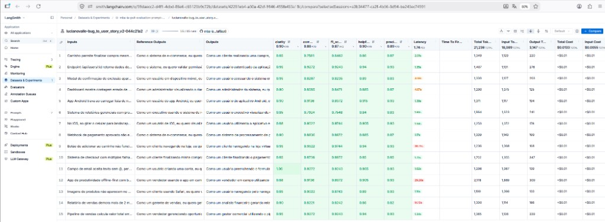

# Pull, Otimização e Avaliação de Prompts (LangChain + LangSmith)

Projeto do desafio: baixar um prompt ruim do LangSmith, otimizar com técnicas
de Prompt Engineering, publicar a versão melhorada e avaliar até todas as
métricas ficarem >= 0.8.

Usa **Gemini** (`LLM_PROVIDER=google`) para gerar e avaliar respostas.

## Técnicas Aplicadas (Fase 2)

No arquivo `prompts/bug_to_user_story_v2.yml` apliquei:

### 1. Few-shot Learning (obrigatório)
**Por quê:** o modelo aprende o formato desejado vendo exemplos concretos de
entrada (bug) e saída (User Story).

**Como apliquei:** 3 exemplos no `system_prompt` (UI simples, validação de email
e bug de segurança), no padrão Entrada → Saída.

### 2. Role Prompting
**Por quê:** definir persona reduz respostas genéricas e alinhadas a “assistente”.

**Como apliquei:** “Você é um Product Manager experiente…” no início do system.

### 3. Chain of Thought (CoT)
**Por quê:** bugs médios/complexos pedem raciocínio antes de escrever a story.

**Como apliquei:** instrução para pensar em 5 passos (persona, problema,
benefício, critérios, contexto técnico) **sem** imprimir esses passos na resposta.

Também incluí regras explícitas, formato Markdown/User Story e tratamento de
edge cases (UI, performance, segurança, integração, relato curto).

## Resultados Finais

### Comparação v1 x v2

| Item           | v1 (ruim)                  | v2 (otimizado) 
|----------------|----------------------------|----------------
| Persona        | genérica                   | Product Manager 
| Few-shot       | não                        | 3 exemplos 
| CoT            | não                        | sim 
| `{bug_report}` | duplicado no system e user | só no user 
| Formato        | vago                       | Markdown + critérios Dado/Quando/Então 
| Edge cases     | não                        | sim 

### Evidências no LangSmith

Avaliação de `lucianovalle/bug_to_user_story_v2` com `gemini-3.5-flash-lite` nos 15 exemplos. 
Todas as médias ficaram >= 0.8.

| Métrica     | Média | Status |
|-------------|-------|--------|
| Helpfulness | 0.90  | >= 0.8 |
| Correctness | 0.88  | >= 0.8 |
| F1-Score    | 0.87  | >= 0.8 |
| Clarity     | 0.90  | >= 0.8 |
| Precision   | 0.89  | >= 0.8 |

Média geral: **0.8896**. Status: aprovado.



- Dataset (público): https://smith.langchain.com/public/2e98992a-1c7f-42f5-8f81-120f893db007/d
- Experimento: https://smith.langchain.com/o/59daecc2-d4f1-4cbd-86e6-c65123b9c72b/datasets/42281eb4-a30a-42cf-9146-495fe453a18c/compare?selectedSessions=a3b34477-ca2f-4b56-8d94-be243ec74591
- Prompt no Hub: https://smith.langchain.com/hub/lucianovalle/bug_to_user_story_v2

## Como Executar

### Pré-requisitos

- Python 3.10+
- Conta LangSmith + API Key
- Handle público do Hub (`USERNAME_LANGSMITH_HUB`)
- API Key Google (Gemini)

### 1. Ambiente

```bash
cd mba-ia-pull-evaluation-prompt
python3 -m venv venv
source venv/bin/activate
pip install -r requirements.txt
```

### 2. Pull do prompt ruim (v1)

```bash
python src/pull_prompts.py
```

### 3. Refatorar

Edite `prompts/bug_to_user_story_v2.yml`

### 4. Push do prompt otimizado (v2)

```bash
python src/push_prompts.py
```

Confirme no LangSmith que `{handle}/bug_to_user_story_v2` está **público**.

### 5. Avaliação

```bash
python src/evaluate.py
```

### 6. Testes

```bash
pytest tests/test_prompts.py -v
```

## Estrutura

- `src/pull_prompts.py` — baixa o prompt semente do Hub
- `src/push_prompts.py` — publica o v2 no Hub
- `src/evaluate.py` — avaliação automática (já pronto)
- `src/metrics.py` — 5 métricas (já pronto)
- `prompts/bug_to_user_story_v1.yml` — prompt ruim
- `prompts/bug_to_user_story_v2.yml` — prompt otimizado
- `datasets/bug_to_user_story.jsonl` — 15 exemplos de avaliação
- `tests/test_prompts.py` — 6 testes de validação
- `docs/avaliacao-langsmith.png` — print das métricas da avaliação no LangSmith
